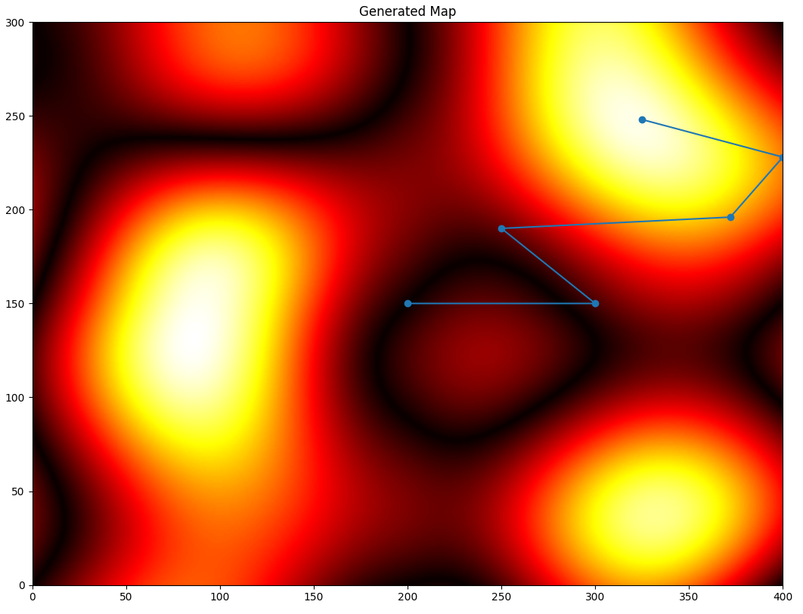

<a name="readme_top"></a>

# ScienceCamp Rover-Challenge

[![Contributors][contributors_shield]][contributors_url]
[![Forks][forks_shield]][forks_url]
[![Stargazers][stars_shield]][stars_url]
[![Issues][issues_shield]][issues_url]
<br>

## 📑 About the project

This is a simulation-environment of the challenge of [ScienceCamp Jena 2023](https://www.eah-jena.de/science-camp). The Camp was about optimization and robotics and one part of the challenge was to program a robot to find the maximum in a given environment.

Currently the following optimization-algorithms are implemented:

- Downhill-Simplex

<p align="right">(<a href="#readme_top">back to top</a>)</p>

## 🎆 Showcase

### Generated Map with a robot using the downhill-simplex-algorithm



<p align="right">(<a href="#readme_top">back to top</a>)</p>

## 🔢 Getting started

1. Clone the repository
   ```sh
   git clone https://github.com/MhouneyLH/robot_challenge.git
   ```
2. Install the pip-dependencies (`pip` should be installed)
   ```sh
   pip install perlin-noise, numpy, matplotlib
   ```
   <p align="right">(<a href="#readme_top">back to top</a>)</p>

## 👨🏻‍💼 Contributing

Contributions are always welcome! Please look at following commit-conventions, while contributing: https://www.conventionalcommits.org/en/v1.0.0/#summary 😃

1. Fork the project.
2. Pick or create an [issue](https://github.com/MhouneyLH/robot_challenge/issues) you want to work on.
3. Create your Feature-Branch. (`git checkout -b feat/best_feature`)
4. Commit your changes. (`git commit -m 'feat: add some cool feature'`)
5. Push to the branch. (`git push origin feat/best_feature`)
6. Open a Pull-Request into the Develop-Branch.
<p align="right">(<a href="#readme_top">back to top</a>)</p>

<!-- Links and Images -->

[contributors_shield]: https://img.shields.io/github/contributors/MhouneyLH/robot_challenge.svg?style=for-the-badge
[contributors_url]: https://github.com/MhouneyLH/robot_challenge/graphs/contributors
[forks_shield]: https://img.shields.io/github/forks/MhouneyLH/robot_challenge.svg?style=for-the-badge
[forks_url]: https://github.com/MhouneyLH/robot_challenge/network/members
[stars_shield]: https://img.shields.io/github/stars/MhouneyLH/robot_challenge.svg?style=for-the-badge
[stars_url]: https://github.com/MhouneyLH/robot_challenge/stargazers
[issues_shield]: https://img.shields.io/github/issues/MhouneyLH/robot_challenge.svg?style=for-the-badge
[issues_url]: https://github.com/MhouneyLH/robot_challenge/issues
